# Service Provider Registration Flow State Machine

This document describes the state machine that governs the lifecycle of a service provider from initial registration through operational messaging with the Dale runtime.

## State Machine Diagram

```mermaid
stateDiagram-v2
    [*] --> Initializing: StartAsync()
    
    Initializing --> RegisteringConnection: Generate/Load Secret
    
    state RegisteringConnection {
        [*] --> ConnectingToRegistrationBroker
        ConnectingToRegistrationBroker --> SubscribedToRegistrationResponse: Subscribe to accepted/denied topics
        SubscribedToRegistrationResponse --> PublishingRegistration: Publish registration request
        PublishingRegistration --> WaitingForAcceptance: Wait for response
        WaitingForAcceptance --> PublishingRegistration: Timeout (30s) / Republish
        WaitingForAcceptance --> [*]: Registration Accepted
    }
    
    RegisteringConnection --> DisconnectingFromRegistrationBroker: Credentials Received
    DisconnectingFromRegistrationBroker --> ConnectingOperational: Disconnect registration client
    
    state ConnectingOperational {
        [*] --> BuildingOperationalOptions
        BuildingOperationalOptions --> ConfiguringLastWill: Configure LWT (health offline)
        ConfiguringLastWill --> EstablishingConnection: Connect to operational broker
        EstablishingConnection --> PublishingInitialHealth: Connection successful
        PublishingInitialHealth --> [*]: Health Online + Unknown
    }
    
    ConnectingOperational --> SetupSchemaPhase: Connected
    ConnectingOperational --> Disconnected: Connection failed

    state SetupSchemaPhase {
        [*] --> CheckSetupRequired
        CheckSetupRequired --> SkipSetup: No setup schema configured
        CheckSetupRequired --> SubscribeToSelectionTopic: Setup schema configured
        SubscribeToSelectionTopic --> PublishingSetupSchema: Subscribe to selection topic
        PublishingSetupSchema --> WaitingForSelection: Publish setup schema
        WaitingForSelection --> PublishingSetupSchema: Timeout (1 min) / Republish
        WaitingForSelection --> ValidatingSelection: Selection received
        ValidatingSelection --> WaitingForSelection: Validation failed
        ValidatingSelection --> BuildingDeclaration: Validation success
        SkipSetup --> BuildingDeclaration: Build declaration (no setup)
        BuildingDeclaration --> [*]: Declaration built
    }
    
    SetupSchemaPhase --> PublishingDeclaration: Declaration ready
    SetupSchemaPhase --> Disconnected: Connection lost

    state PublishingDeclaration {
        [*] --> SerializingDeclaration
        SerializingDeclaration --> PublishingToDeclarationTopic: Serialize to JSON
        PublishingToDeclarationTopic --> [*]: Published (retained)
    }
    
    PublishingDeclaration --> SettingUpHandlers: Declaration published
    PublishingDeclaration --> Disconnected: Connection lost

    state SettingUpHandlers {
        [*] --> RegisteringHealthHandler
        RegisteringHealthHandler --> RegisteringContractHandlers: Subscribe to health/get
        RegisteringContractHandlers --> SubscribingToTopics: Register all handlers
        SubscribingToTopics --> [*]: Subscriptions active
    }
    
    SettingUpHandlers --> Operational: Handlers ready
    SettingUpHandlers --> Disconnected: Connection lost

    state Operational {
        [*] --> ListeningForMessages

        state "Message Processing" as MsgProc {
            [*] --> MatchingTopic
            MatchingTopic --> DispatchingToHandler: Topic matches handler
            MatchingTopic --> ForwardingToApplicationHandler: No handler match

            state "Handler Execution Examples" as HandlerExec {
                [*] --> HealthHandler: Health query topic matched
                [*] --> ContractHandler: Contract topic matched
                [*] --> CustomHandler: Custom topic matched
                HealthHandler --> [*]: Publish health response
                ContractHandler --> [*]: Process contract message
                CustomHandler --> [*]: Custom logic executed
            }

            DispatchingToHandler --> HandlerExec: Invoke matched handler(s)
            HandlerExec --> [*]: Handler completed
            ForwardingToApplicationHandler --> [*]: Event fired
        }

        ListeningForMessages --> MsgProc: Message received
        MsgProc --> ListeningForMessages: Processing complete
    }
    
    Operational --> Disconnected: Connection lost
    
    state Disconnected {
        [*] --> CancellingOngoingFlows
        CancellingOngoingFlows --> CheckingShutdown: Cancel registration/setup loops
        CheckingShutdown --> ShutdownComplete: App stopping
        CheckingShutdown --> RestartingFlow: Not app stopping
        RestartingFlow --> [*]: Trigger StartAsync()
    }
    
    Disconnected --> RegisteringConnection: Auto-reconnect
    Disconnected --> [*]: App shutdown
    
    Operational --> ShuttingDown: App stopping token cancelled
    
    state ShuttingDown {
        [*] --> PublishingOfflineHealth
        PublishingOfflineHealth --> DisconnectingCleanly: Offline + Unknown health
        DisconnectingCleanly --> [*]: Disconnected
    }
    
    ShuttingDown --> [*]: Shutdown complete
    
    note right of RegisteringConnection
        Registration broker:
        - Connect with serviceProviderIdentifier as clientId
        - Subscribe: system/.../accepted/{secret}
        - Subscribe: system/.../denied/{secret}
        - Publish: system/.../request/{secret} (retained, payload carries serviceProviderIdentifier)
        - Retry every 30 seconds until accepted
    end note
    
    note right of SetupSchemaPhase
        Setup schema flow (optional):
        - Subscribe: {installationTopic}/{serviceProviderIdentifier}/serviceProvider/setup/selection
        - Publish: {installationTopic}/{serviceProviderIdentifier}/serviceProvider/setup/schema
        - Blocks startup until selection received
        - Republishes every 1 minute
        - Validates selection before proceeding
    end note
    
    note right of Operational
        All operational messaging flows through:
        - Health queries: {installationTopic}/{serviceProviderIdentifier}/component/health/get
        - Contract messages: {installationTopic}/{serviceProviderIdentifier}/{service}/{contract}/#
        - Custom handlers: User-defined topic patterns
    end note
```

## State Descriptions

### Initializing
**Entry Point**: `StartAsync()` is called by the host application.

**Responsibilities**:
- Store the application stopping token
- Register shutdown handler
- Load connection data and secret from configuration

**Exit**: Transitions to **RegisteringConnection** to begin registration flow.

---

### RegisteringConnection
**Purpose**: Establish identity with the Dale runtime and obtain operational credentials.

**Sub-states**:

1. **ConnectingToRegistrationBroker**: Connect to the registration broker using the configured host/port with the service provider identifier as the client ID.

2. **SubscribedToRegistrationResponse**: Subscribe to both acceptance and denial topics that contain the secret:
   - `system/serviceProvider/registration/accepted/{secret}`
   - `system/serviceProvider/registration/denied/{secret}`

3. **PublishingRegistration**: Publish the registration request to `system/serviceProvider/registration/request/{secret}` with QoS 0, retained, content-type `application/json`, payload `ServiceProviderRegistrationRequestPayload` carrying the `serviceProviderIdentifier` (mesh reads the identifier from the payload, not the topic).

4. **WaitingForAcceptance**: Wait for a registration response. If no response is received within 30 seconds, republish the registration request. This loop continues until acceptance is received or the flow is cancelled.

**Exit Conditions**:
- **Success**: Registration accepted payload received containing `installationTopic`, `host`, `port`, `clientId`, `username`, `password` → Transition to **DisconnectingFromRegistrationBroker**
- **Cancellation (app stopping)**: Application shutdown token cancelled → Exit to final state (application termination)
- **Cancellation (reconnection)**: If the operational client disconnects while a registration is in progress (during a re-registration attempt after previous disconnection), the old registration flow is cancelled via `_registrationCts` and exits gracefully. A new `StartAsync()` call is already running, starting a fresh registration flow. This is an internal cleanup mechanism, not a state transition.

**Error Handling**: Publication failures are logged and retried after 30 seconds.

**Notes**:
- This state uses a **separate registration client**, not the operational client
- The **Disconnected** state (which handles operational client disconnections) cannot be entered from this state
- On first startup, this is the entry point after initialization
- On reconnection scenarios, a new registration flow starts while the old one is being cancelled

---

### DisconnectingFromRegistrationBroker
**Purpose**: Clean disconnect from the registration broker.

**Responsibilities**:
- Disconnect the registration MQTT client
- Store the received operational credentials in `OperationalData`

**Exit**: Transitions to **ConnectingOperational**.

---

### ConnectingOperational
**Purpose**: Establish the operational MQTT connection using the credentials received during registration.

**Sub-states**:

1. **BuildingOperationalOptions**: Create MQTT client options with:
   - Client ID from registration response
   - Credentials (username/password) from registration response
   - MQTT 5.0 protocol version
   - Target broker from registration response (may differ from registration broker)

2. **ConfiguringLastWill**: Configure Last Will Testament (LWT) so the broker automatically publishes offline health status if the connection is lost unexpectedly:
   - Topic: `{installationTopic}/{serviceProviderIdentifier}/component/health/state`
   - Payload: FlatBuffer `ComponentHealthStatusPayload` with `ConnectionStatus.Offline` and `HealthStatus.Unknown`
   - QoS: 1 (at least once)
   - Retain: true

3. **EstablishingConnection**: Connect to the operational broker.

4. **PublishingInitialHealth**: Publish the initial health state with `ConnectionStatus.Online` and `HealthStatus.Unknown` to the health state topic (retained).

**Exit Conditions**:
- **Success**: Connection established and initial health published → Transition to **SetupSchemaPhase**
- **Failure**: Connection failed → Transition to **Disconnected** (auto-reconnect will retry)
- **Connection Lost**: If the operational client disconnects after connecting but before completing this phase → Transition to **Disconnected**

---

### SetupSchemaPhase
**Purpose**: Optionally send a setup schema to the Dale runtime and wait for user selection (blocks startup until selection is received).

**Sub-states**:

1. **CheckSetupRequired**: Check if `SetupSchemaPayload` is configured.

2. **SkipSetup**: If no setup schema is configured, skip to building the declaration directly.

3. **SubscribeToSelectionTopic**: Subscribe to `{installationTopic}/{serviceProviderIdentifier}/serviceProvider/setup/selection` to receive the setup selection response.

4. **PublishingSetupSchema**: Publish the setup schema payload to `{installationTopic}/{serviceProviderIdentifier}/serviceProvider/setup/schema` as retained JSON with:
   - Content-Type: `application/json`
   - ResponseTopic: pointing to the selection topic
   - CorrelationData: unique identifier for this request
   - Schema user property: `ServiceProviderSetupSchemaPayload`

5. **WaitingForSelection**: Wait for a selection message. If no selection is received within 1 minute, republish the setup schema. This loop continues until a valid selection is received or the flow is cancelled.

6. **ValidatingSelection**: When a selection message is received:
   - Verify the correlation data matches
   - Deserialize the `ServiceProviderSetupSelectionPayload`
   - If a validation callback is configured, invoke it
   - If validation fails, return to **WaitingForSelection**
   - If validation succeeds, proceed to **BuildingDeclaration**

7. **BuildingDeclaration**: Invoke the appropriate declaration callback:
   - If setup was used: `DeclarationCallbackWithSetup(selection)`
   - If no setup: `DeclarationCallback()`

**Exit Conditions**:
- **Success**: Declaration built → Transition to **PublishingDeclaration**
- **Connection Lost**: Operational client disconnected → Transition to **Disconnected** (auto-reconnect will retry)
- **Cancellation (app stopping)**: Application shutdown token cancelled → Exit to final state

**Notes**:
- This phase **blocks** the service provider startup until a selection is received
- Warnings are logged indicating that startup is blocked
- The setup selection subscription is removed after a valid selection is received

---

### PublishingDeclaration
**Purpose**: Publish the service provider declaration to inform the Dale runtime about available services and contracts.

**Sub-states**:

1. **SerializingDeclaration**: Serialize the `ServiceProviderDeclarationPayload` to JSON.

2. **PublishingToDeclarationTopic**: Publish to `{installationTopic}/{serviceProviderIdentifier}/serviceProvider/declaration` as retained JSON with:
   - Content-Type: `application/json`
   - QoS: 0
   - Retain: true
   - CorrelationData: unique identifier
   - Schema user property: `ServiceProviderDeclarationPayload`

**Exit**: Transitions to **SettingUpHandlers** when declaration is successfully published.

**Exit Conditions**:
- **Success**: Declaration published → Transition to **SettingUpHandlers**
- **Connection Lost**: Operational client disconnected → Transition to **Disconnected** (auto-reconnect will retry)

---

### SettingUpHandlers
**Purpose**: Register message handlers and subscribe to operational topics.

**Sub-states**:

1. **RegisteringHealthHandler**: Register a handler for the health query topic `{installationTopic}/{serviceProviderIdentifier}/component/health/get` that:
   - Evaluates the current health status using the configured `HealthCheckStatusProviderFunc`
   - Publishes a health response to the `ResponseTopic` from the request
   - Echoes the `CorrelationData` from the request

2. **RegisteringContractHandlers**: Register all handlers configured via the `HandlerSetupCallback`:
   - Contract handlers use wildcard topics: `{installationTopic}/{serviceProviderIdentifier}/{service}/{contract}/#`
   - Non-contract handlers use exact topic matches
   - Store handlers in the `Handlers` list with their topic filters and matching patterns

3. **SubscribingToTopics**: Build the subscription options from all registered handler topic filters and subscribe to the operational broker.

**Exit**: Transitions to **Operational** when all subscriptions are active.

**Exit Conditions**:
- **Success**: Subscriptions active → Transition to **Operational**
- **Connection Lost**: Operational client disconnected → Transition to **Disconnected** (auto-reconnect will retry)

---

### Operational
**Purpose**: Process incoming messages and handle operational messaging.

**Sub-states**:

1. **ListeningForMessages**: Idle state waiting for incoming messages.

2. **Message Processing**: All incoming messages flow through this processing pipeline:
   - **MatchingTopic**: Check if the incoming message topic matches any registered handler using `topic.Contains(handlerTopicPartToMatch)`. Multiple handlers can match the same topic.
   - **DispatchingToHandler**: If one or more handlers match, invoke each handler asynchronously in sequence. The handler type (health, contract, custom) determines the specific processing logic.
   - **ForwardingToApplicationHandler**: If no handlers match, invoke the `ApplicationMessageReceivedAsync` event to allow application-level handling.

3. **Handler Execution Examples**: These are not separate states but illustrate what happens inside **DispatchingToHandler**:
   - **HealthHandler**: When the health query topic `{installationTopic}/{serviceProviderIdentifier}/component/health/get` matches:
     - Evaluate health status via `HealthCheckStatusProviderFunc`
     - Publish health response to the `ResponseTopic` from the request
     - Echo the `CorrelationData` from the request
   - **ContractHandler**: When a contract topic `{installationTopic}/{serviceProviderIdentifier}/{service}/{contract}/#` matches:
     - Process contract-specific messages according to contract type (e.g., DigitalIo, AnalogIo, ModbusRtu, custom handlers)
     - Publish state updates, respond to commands, or handle request-response patterns
   - **CustomHandler**: When a custom topic matches:
     - Execute application-defined logic

**Exit Conditions**:
- **Connection Lost**: Transition to **Disconnected**
- **App Stopping**: Transition to **ShuttingDown**

**Notes**:
- All incoming messages go through the same handler matching logic - there are no separate "fast paths" for health or contract messages
- Handlers are matched using substring matching (`topic.Contains(topicPartToMatch)`), so wildcards in subscriptions are matched against exact incoming topics
- Multiple handlers can match the same message (they execute sequentially)
- All published messages include:
  - User property `PublishedAt`: ISO 8601 UTC timestamp
  - User property `Schema`: Payload type name
  - Content-Type: `application/x-flatbuffer`, `application/json`, or `application/octet-stream`

---

### Disconnected
**Purpose**: Handle unexpected disconnections and trigger recovery.

**Sub-states**:

1. **CancellingOngoingFlows**: Cancel any ongoing registration or setup schema loops by cancelling their dedicated `CancellationTokenSource` instances:
   - `_registrationCts` for registration flow
   - `_setupSchemaCts` for setup schema flow

2. **CheckingShutdown**: Check if the disconnection is due to application shutdown (`_appStoppingToken.IsCancellationRequested`).

3. **ShutdownComplete**: If app is stopping, exit to final state.

4. **RestartingFlow**: If not stopping, trigger a new `StartAsync()` call to restart the entire flow from registration.

**Exit Conditions**:
- **Auto-reconnect**: Transition back to **RegisteringConnection**
- **App Shutdown**: Transition to final state

**Notes**:
- This ensures that any orphaned loops (registration publish loop, setup schema publish loop) are properly cancelled before restarting
- Prevents multiple parallel flows from running simultaneously
- The disconnection handler fires on any connection loss, including network failures or broker restarts

---

### ShuttingDown
**Purpose**: Clean shutdown when the application is stopping.

**Sub-states**:

1. **PublishingOfflineHealth**: Publish a final health status with `ConnectionStatus.Offline` and `HealthStatus.Unknown` to the health state topic (retained).

2. **DisconnectingCleanly**: Disconnect from the operational broker with a normal disconnection reason code and reason string "app shutdown".

**Exit**: Transitions to final state (application termination).

**Notes**:
- The final health publication ensures that monitoring systems immediately see the service provider as offline
- The LWT configured during connection would also trigger, but this provides a clean, explicit status update

---

## Transition Triggers

| From State | To State | Trigger | Notes |
|------------|----------|---------|-------|
| [*] | Initializing | `StartAsync()` called | Application starts the service provider |
| Initializing | RegisteringConnection | Configuration loaded | Secret and connection data ready |
| RegisteringConnection | DisconnectingFromRegistrationBroker | Registration accepted | Credentials received |
| DisconnectingFromRegistrationBroker | ConnectingOperational | Registration client disconnected | Ready for operational connection |
| ConnectingOperational | SetupSchemaPhase | Connection successful | Operational connection established |
| ConnectingOperational | Disconnected | Connection failed | Operational client connection attempt failed |
| SetupSchemaPhase | PublishingDeclaration | Declaration built | Setup complete (or skipped) |
| SetupSchemaPhase | Disconnected | Connection lost | Operational client disconnected during setup |
| PublishingDeclaration | SettingUpHandlers | Declaration published | Ready to register handlers |
| PublishingDeclaration | Disconnected | Connection lost | Operational client disconnected during declaration |
| SettingUpHandlers | Operational | Subscriptions active | Ready for operational messaging |
| SettingUpHandlers | Disconnected | Connection lost | Operational client disconnected during handler setup |
| Operational | Disconnected | Connection lost | Network failure or broker restart |
| Operational | ShuttingDown | App stopping token cancelled | Application shutdown initiated |
| Disconnected | RegisteringConnection | Auto-reconnect | Retry registration flow (new `StartAsync()` call) |
| Disconnected | [*] | App stopping | Application shutdown |
| ShuttingDown | [*] | Disconnected cleanly | Shutdown complete |

**Notes**:
- **RegisteringConnection** uses a separate MQTT client and cannot transition to **Disconnected** state
- **Disconnected** state is only entered when the **operational client** (`_operationalClient`) disconnects
- The operational client can disconnect during: ConnectingOperational, SetupSchemaPhase, PublishingDeclaration, SettingUpHandlers, or Operational phases
- Cancellations during RegisteringConnection (due to reconnection or app stopping) cause the registration flow to exit gracefully without a formal state transition

## Cancellation and Error Handling

### Registration Loop Cancellation
The registration loop can be cancelled by:
- **Connection loss**: Disconnection handler cancels `_registrationCts` and triggers `StartAsync()` again
- **App stopping**: `_appStoppingToken` is cancelled, propagating through the registration loop

When cancelled, the loop throws `OperationCanceledException`, which is caught if not due to app stopping.

### Setup Schema Loop Cancellation
The setup schema loop can be cancelled by:
- **Connection loss**: Disconnection handler cancels `_setupSchemaCts` and triggers `StartAsync()` again
- **App stopping**: `_appStoppingToken` is cancelled, propagating through the setup schema loop

When cancelled, the loop throws `OperationCanceledException`, which is caught if not due to app stopping.

### Parallel Flow Prevention
When `OnDisconnectedAsync` is called:
1. Cancel `_registrationCts` → stops any ongoing registration loop
2. Cancel `_setupSchemaCts` → stops any ongoing setup schema loop
3. Call `StartAsync()` → starts a fresh flow from the beginning

If the previous `StartAsync()` call was in the middle of registration or setup schema waiting, it will receive an `OperationCanceledException` from the cancelled token and exit gracefully, allowing the new flow to proceed without conflicts.

### Error Recovery
- **Registration publish failure**: Log warning, retry after 30 seconds
- **Setup schema publish failure**: Log warning, retry after 1 minute
- **Health publish failure**: Log warning, continue operation
- **Declaration publish failure**: Currently commented out, would log warning
- **Connection failure**: Rely on disconnection handler to restart flow

## MQTT Client Configuration

### Registration Client
- **Client ID**: `{serviceProviderIdentifier}`
- **Protocol**: MQTT 5.0
- **Broker**: From configuration (default: `nanomq:1883`)
- **Credentials**: None (anonymous connection)
- **Lifetime**: Temporary (disconnected after registration accepted)

### Operational Client
- **Client ID**: From registration response (e.g., `sp-hal-sim-a1b2c3`)
- **Protocol**: MQTT 5.0
- **Broker**: From registration response (host/port)
- **Credentials**: Username/password from registration response
- **Last Will Testament**: Configured to publish offline health on unexpected disconnection
- **Lifetime**: Persistent (maintained throughout operational phase)

## Topic Patterns

### Registration Topics
| Topic | Direction | QoS | Retain | Content |
|-------|-----------|-----|--------|---------|
| `system/serviceProvider/registration/request/{secret}` | Provider → Runtime | 0 | Yes | JSON `ServiceProviderRegistrationRequestPayload` (carries `serviceProviderIdentifier`) |
| `system/serviceProvider/registration/accepted/{secret}` | Runtime → Provider | 0 | No | JSON credentials |
| `system/serviceProvider/registration/denied/{secret}` | Runtime → Provider | 0 | No | JSON denial reason |

### Setup Schema Topics (Optional)
| Topic | Direction | QoS | Retain | Content |
|-------|-----------|-----|--------|---------|
| `{installationTopic}/{serviceProviderIdentifier}/serviceProvider/setup/schema` | Provider → Runtime | 0 | Yes | JSON setup schema |
| `{installationTopic}/{serviceProviderIdentifier}/serviceProvider/setup/selection` | Runtime → Provider | 0 | No | JSON setup selection |

### Declaration Topics
| Topic | Direction | QoS | Retain | Content |
|-------|-----------|-----|--------|---------|
| `{installationTopic}/{serviceProviderIdentifier}/serviceProvider/declaration` | Provider → Runtime | 0 | Yes | JSON declaration |

### Health Topics
| Topic | Direction | QoS | Retain | Content |
|-------|-----------|-----|--------|---------|
| `{installationTopic}/{serviceProviderIdentifier}/component/health/state` | Provider → Runtime | 0 | Yes | FlatBuffer health status (state publication) |
| `{installationTopic}/{serviceProviderIdentifier}/component/health/get` | Runtime → Provider | 0 | No | Empty (uses ResponseTopic) |
| `{ResponseTopic}` (from health/get request) | Provider → Runtime | 0 | No | FlatBuffer health status (query response) |

### Contract Topics
| Topic Pattern | Direction | QoS | Retain | Content |
|---------------|-----------|-----|--------|---------|
| `{installationTopic}/{serviceProviderIdentifier}/{service}/{contract}/#` | Bidirectional | Varies | Varies | Contract-specific |

## Implementation Notes

### Thread Safety
- The `ServiceProviderClient` is designed to be thread-safe for single `StartAsync()` invocations
- Multiple concurrent `StartAsync()` calls are prevented by the cancellation mechanism
- The disconnection handler ensures only one registration flow is active at a time

### Idempotency
- Registration requests are idempotent (can be retried safely)
- Declaration publications are retained and idempotent
- Health state publications (`component/health/state`) are retained and idempotent
- Health query responses (to `ResponseTopic`) are ephemeral (not retained) to avoid confusion about current state
- Setup schema publications are retained but the selection response is consumed once

### State Persistence
- The secret is persisted across restarts (generated once, reused)
- Operational credentials are ephemeral (requested on each registration)
- Handler registrations are configured at startup (not persisted)

### Retry Strategies
- **Registration**: Retry every 30 seconds indefinitely
- **Setup schema**: Retry every 1 minute indefinitely (blocks startup)
- **Connection failure**: Immediate retry via disconnection handler
- **Message publish failure**: Log warning, no automatic retry (except for registration and setup schema)
