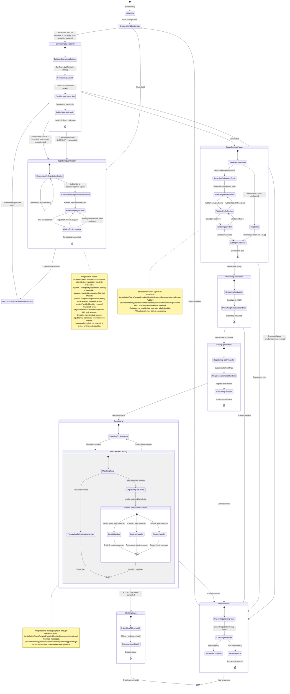

# Service Provider Registration Flow State Machine

This document describes the state machine that governs the lifecycle of a service provider from initial registration through operational messaging with the Dale runtime.

## The registration contract

Everything below follows from two invariants the platform guarantees, and they are worth stating first — a service provider written against them needs no guesswork about broker
internals:

1. **Every request mints a new operational password, and the previous one stops working.** Assuming this is always safe: where a deployment happens to reuse an existing password
   instead, the service provider simply receives the same one twice, which costs it nothing.
2. **Credentials in an accepted message were tested and were valid when it was published.** They are connected with against the broker before being issued.

What follows from them:

- **A broker refusing credentials with `0x86`/`0x87` means they have since become invalidated** — never "not applied yet". Retrying them cannot help; request new ones. Other broker
  errors may be transient, so retrying the connection is fine.
- **Requesting faster than the round trip destroys each answer before it can be used**, since each request invalidates the last password. The round trip is ~3s healthy and under
  ~15s loaded, which is what makes the 30-second default safe.
- **Nothing is retained**, so a service provider has to keep requesting until it is accepted. A denial is informational, not terminal.
- **Approval is polled, not pushed.** A customer's decision arrives on the next request, so the republish interval is also the approval latency.
- **Credentials may be cached and tried first on reconnect**, which is what removes registration from the reconnect path entirely. There is no guarantee a cached credential is still
  valid — the broker's password file can be recreated by a platform update — so the rule above applies: a refusal means it is dead, so register again rather than retrying it.
- **The secret is proof of identity and must be high-entropy random.** It is stored as a fast unsalted hash, on the assumption that it cannot be guessed or brute-forced.

## State Machine Diagram

```mermaid
stateDiagram-v2
    [*] --> Initializing: StartAsync()

    Initializing --> CheckingHeldCredentials: Load configuration

    CheckingHeldCredentials --> ConnectingOperational: Credentials held (in memory, or persisted from an earlier process)
    CheckingHeldCredentials --> RegisteringConnection: None held

    state RegisteringConnection {
        [*] --> ConnectingToRegistrationBroker
        ConnectingToRegistrationBroker --> ConnectingToRegistrationBroker: Connection refused / retry
        ConnectingToRegistrationBroker --> SubscribedToRegistrationResponse: Subscribe to accepted/denied topics
        SubscribedToRegistrationResponse --> PublishingRegistration: Publish registration request
        PublishingRegistration --> WaitingForAcceptance: Wait for response
        WaitingForAcceptance --> PublishingRegistration: Republish interval elapsed
        WaitingForAcceptance --> PublishingRegistration: Denied (informational, loop continues)
        WaitingForAcceptance --> [*]: Registration Accepted
    }
    
    RegisteringConnection --> DisconnectingFromRegistrationBroker: Credentials Received
    DisconnectingFromRegistrationBroker --> ConnectingOperational: Disconnect registration client
    
    state ConnectingOperational {
        [*] --> BuildingOperationalOptions
        BuildingOperationalOptions --> ConfiguringLastWill: Configure LWT (health offline)
        ConfiguringLastWill --> EstablishingConnection: Connect to operational broker
        EstablishingConnection --> PublishingInitialHealth: Connection successful
        PublishingInitialHealth --> [*]: Health Online + Unknown
    }
    
    ConnectingOperational --> SetupSchemaPhase: Connected
    ConnectingOperational --> RegisteringConnection: Credentials refused (0x86/0x87) — discarded
    ConnectingOperational --> Disconnected: Transport failure (credentials kept, retried)
    ConnectingOperational --> RegisteringConnection: Unreachable for 90s — discarded, endpoint no longer trusted

    state SetupSchemaPhase {
        [*] --> CheckSetupRequired
        CheckSetupRequired --> SkipSetup: No setup schema configured
        CheckSetupRequired --> SubscribeToSelectionTopic: Setup schema configured
        SubscribeToSelectionTopic --> PublishingSetupSchema: Subscribe to selection topic
        PublishingSetupSchema --> WaitingForSelection: Publish setup schema
        WaitingForSelection --> PublishingSetupSchema: Publish failed / Republish
        WaitingForSelection --> ValidatingSelection: Selection received
        ValidatingSelection --> WaitingForSelection: Validation failed
        ValidatingSelection --> BuildingDeclaration: Validation success
        SkipSetup --> BuildingDeclaration: Build declaration (no setup)
        BuildingDeclaration --> [*]: Declaration built
    }
    
    SetupSchemaPhase --> PublishingDeclaration: Declaration ready
    SetupSchemaPhase --> Disconnected: Connection lost

    state PublishingDeclaration {
        [*] --> SerializingDeclaration
        SerializingDeclaration --> PublishingToDeclarationTopic: Serialize to JSON
        PublishingToDeclarationTopic --> [*]: Published (retained)
    }
    
    PublishingDeclaration --> SettingUpHandlers: Declaration published
    PublishingDeclaration --> Disconnected: Connection lost

    state SettingUpHandlers {
        [*] --> RegisteringHealthHandler
        RegisteringHealthHandler --> RegisteringContractHandlers: Subscribe to health/get
        RegisteringContractHandlers --> SubscribingToTopics: Register all handlers
        SubscribingToTopics --> [*]: Subscriptions active
    }
    
    SettingUpHandlers --> Operational: Handlers ready
    SettingUpHandlers --> Disconnected: Connection lost

    state Operational {
        [*] --> ListeningForMessages

        state "Message Processing" as MsgProc {
            [*] --> MatchingTopic
            MatchingTopic --> DispatchingToHandler: Topic matches handler
            MatchingTopic --> ForwardingToApplicationHandler: No handler match

            state "Handler Execution Examples" as HandlerExec {
                [*] --> HealthHandler: Health query topic matched
                [*] --> ContractHandler: Contract topic matched
                [*] --> CustomHandler: Custom topic matched
                HealthHandler --> [*]: Publish health response
                ContractHandler --> [*]: Process contract message
                CustomHandler --> [*]: Custom logic executed
            }

            DispatchingToHandler --> HandlerExec: Invoke matched handler(s)
            HandlerExec --> [*]: Handler completed
            ForwardingToApplicationHandler --> [*]: Event fired
        }

        ListeningForMessages --> MsgProc: Message received
        MsgProc --> ListeningForMessages: Processing complete
    }
    
    Operational --> Disconnected: Connection lost
    
    state Disconnected {
        [*] --> CancellingOngoingFlows
        CancellingOngoingFlows --> CheckingShutdown: Cancel registration/setup loops
        CheckingShutdown --> ShutdownComplete: App stopping
        CheckingShutdown --> RestartingFlow: Not app stopping
        RestartingFlow --> [*]: Trigger StartAsync()
    }
    
    Disconnected --> CheckingHeldCredentials: Auto-reconnect
    Disconnected --> [*]: App shutdown
    
    Operational --> ShuttingDown: App stopping token cancelled
    
    state ShuttingDown {
        [*] --> PublishingOfflineHealth
        PublishingOfflineHealth --> DisconnectingCleanly: Offline + Unknown health
        DisconnectingCleanly --> [*]: Disconnected
    }
    
    ShuttingDown --> [*]: Shutdown complete
    
    note right of RegisteringConnection
        Registration broker:
        - Connect with a fresh random GUID as clientId (the registration client-id)
        - Subscribe: system/.../accepted/{registrationClientId}
        - Subscribe: system/.../denied/{registrationClientId}
        - Publish: system/.../request/{registrationClientId}
          (NOT retained; payload carries serviceProviderIdentifier + secret)
        - Republish every RegistrationRepublishInterval (default 30s) until accepted
        - Denial is non-terminal: logged, republishing continues, recovers when cleared
        - Approval is polled, not pushed: it arrives on the next republish
    end note
    
    note right of SetupSchemaPhase
        Setup schema flow (optional):
        - Subscribe: {installationTopic}/{serviceProviderIdentifier}/serviceProvider/setup/selection
        - Publish: {installationTopic}/{serviceProviderIdentifier}/serviceProvider/setup/schema
        - Blocks startup until selection received
        - Retained, so republished only after a failed publish
        - Validates selection before proceeding
    end note
    
    note right of Operational
        All operational messaging flows through:
        - Health queries: {installationTopic}/{serviceProviderIdentifier}/component/health/get
        - Contract messages: {installationTopic}/{serviceProviderIdentifier}/{service}/{contract}/#
        - Custom handlers: User-defined topic patterns
    end note
```

## State Descriptions

### Initializing

**Entry Point**: `StartAsync()` is called by the host application.

**Responsibilities**:

- Store the application stopping token
- Register shutdown handler
- Load connection data and secret from configuration

**Exit**: Transitions to **CheckingHeldCredentials**.

---

### CheckingHeldCredentials

**Purpose**: Reconnect without registering again whenever possible.

The broker authenticates operational clients from its own password file, so registration is needed to **provision** a credential, never to **reconnect** with one. Before registering, the
SDK therefore uses any credentials it already holds:

1. The in-memory credentials from a previous connection, which survive a reconnect.
2. Failing that, the persisted credentials from `IOperationalCredentialsStore`, which survive a process restart — including a whole gateway reboot, where the service provider can
   come back before the rest of the platform has finished starting.

If neither yields credentials, the flow registers as before. A held credential carries **no guarantee of still being valid**: the broker's password file can be recreated by a
platform update, and a denial or deletion removes the entry. That case is handled at **ConnectingOperational** rather than here.

**Exit Conditions**:

- **Credentials held** → **ConnectingOperational**
- **None held** → **RegisteringConnection**

---

### RegisteringConnection

**Purpose**: Establish identity with the Dale runtime and obtain operational credentials.

**Sub-states**:

1. **ConnectingToRegistrationBroker**: Connect to the registration broker using the configured host/port, authenticating as the well-known `registration` bootstrap user, with a
   **freshly generated random GUID as the MQTT client ID** — the *registration client-id*. A refused connection is not fatal (the broker may not have provisioned the `registration`
   user yet) and is retried after 5 seconds.

2. **SubscribedToRegistrationResponse**: Subscribe to both response topics for this attempt's registration client-id:
    - `system/serviceProvider/registration/accepted/{registrationClientId}`
    - `system/serviceProvider/registration/denied/{registrationClientId}`

   Subscribing happens **before** the request is published. Nothing is retained, so a response that arrives before the subscription is established is lost and costs a full
   republish interval.

3. **PublishingRegistration**: Publish the registration request to `system/serviceProvider/registration/request/{registrationClientId}` with QoS 1, **not retained**, content-type
   `application/json`, payload `ServiceProviderRegistrationRequestPayload` carrying the `serviceProviderIdentifier` **and the secret**. The identifier and secret are read from the
   payload, the client-id from the topic.

4. **WaitingForAcceptance**: Wait for a registration response. The registration request is (re)published every `RegistrationRepublishInterval` (default 30 seconds) until acceptance
   arrives. Publishing on an interval rather than once is what makes the whole flow recoverable, because **nothing is retained in either direction and outcomes are never
   pushed**:
    - A **denial** (`system/serviceProvider/registration/denied/{registrationClientId}`) is **non-terminal** — logged at warning level with the reason carried in the denial, after which
      the loop keeps republishing. A customer can deny and later approve; that approval reaches the service provider only on a further request.
    - An **approval is polled, not pushed**. A customer's decision reaches this service provider on its next request, so the republish interval is also the approval latency.

   This loop continues until acceptance is received or the flow is cancelled.

**The registration client-id** is security-relevant: it is what routes the credentials back, and therefore what stops one service provider reading another's. It is generated fresh
per registration attempt (reused across reconnects *within* one attempt), never persisted, and never derived from configuration or identity. The registration connection's MQTT
client-id is exactly the value the topics are keyed on — the broker's `%c` ACL pattern expands to the *connecting* client's id, so a mismatch would break that enforcement.

**Exit Conditions**:

- **Success**: Registration accepted payload received containing `installationTopic`, `host`, `port`, `clientId`, `username`, `password` → Transition to *
  *DisconnectingFromRegistrationBroker**
- **Cancellation (app stopping)**: Application shutdown token cancelled → Exit to final state (application termination)
- **Cancellation (reconnection)**: If the operational client disconnects while a registration is in progress (during a re-registration attempt after previous disconnection), the
  old registration flow is cancelled via `_registrationCts` and exits gracefully. A new `StartAsync()` call is already running, starting a fresh registration flow. This is an
  internal cleanup mechanism, not a state transition.

**Error Handling**: Connection and publication failures are logged and retried after 5 seconds.

**Notes**:

- This state uses a **separate registration client**, not the operational client
- The **Disconnected** state (which handles operational client disconnections) cannot be entered from this state
- On first startup, this is the entry point after initialization
- On reconnection scenarios, a new registration flow starts while the old one is being cancelled

---

### DisconnectingFromRegistrationBroker

**Purpose**: Clean disconnect from the registration broker.

**Responsibilities**:

- Disconnect the registration MQTT client
- Store the received operational credentials in `OperationalData`

**Exit**: Transitions to **ConnectingOperational**.

---

### ConnectingOperational

**Purpose**: Establish the operational MQTT connection using the credentials received during registration.

**Sub-states**:

1. **BuildingOperationalOptions**: Create MQTT client options with:
    - Client ID from registration response
    - Credentials (username/password) from registration response
    - MQTT 5.0 protocol version
    - Target broker from registration response (may differ from registration broker)

2. **ConfiguringLastWill**: Configure Last Will Testament (LWT) so the broker automatically publishes offline health status if the connection is lost unexpectedly:
    - Topic: `{installationTopic}/{serviceProviderIdentifier}/component/health/state`
    - Payload: FlatBuffer `ComponentHealthStatusPayload` with `ConnectionStatus.Offline` and `HealthStatus.Unknown`
    - QoS: 1 (at least once)
    - Retain: true

3. **EstablishingConnection**: Connect to the operational broker.

4. **PublishingInitialHealth**: Publish the initial health state with `ConnectionStatus.Online` and `HealthStatus.Unknown` to the health state topic (retained).

**Exit Conditions**:

- **Success**: Connection established and initial health published → Transition to **SetupSchemaPhase**
- **Credentials refused** (CONNACK `0x86` / `0x87`) → credentials discarded, transition to **RegisteringConnection**
- **Transport failure** (anything else): credentials kept → Transition to **Disconnected** (auto-reconnect will retry them). Once they have been unreachable for 90 seconds they are
  discarded too — held credentials carry the host and port they were issued with, so a broker that moved would otherwise be retried forever while the configured connection data is
  ignored. The next attempt then finds nothing held and registers, which uses that configured data
- **Connection Lost**: If the operational client disconnects after connecting but before completing this phase → Transition to **Disconnected**

**Interpreting a refusal.** Freshly issued credentials are connected with against the broker to confirm they are live *before* being published, so credentials in an accepted
message were valid when it was published. A later `0x86`/`0x87` therefore never means "not applied yet" — it means they have since been invalidated (revoked, or overwritten by a later
registration). Retrying them cannot help, so the SDK discards them, clears any persisted copy, and registers again. Every other failure leaves the credentials unjudged, so they are
kept and simply retried.

---

### SetupSchemaPhase

**Purpose**: Optionally send a setup schema to the Dale runtime and wait for user selection (blocks startup until selection is received).

**Sub-states**:

1. **CheckSetupRequired**: Check if `SetupSchemaPayload` is configured.

2. **SkipSetup**: If no setup schema is configured, skip to building the declaration directly.

3. **SubscribeToSelectionTopic**: Subscribe to `{installationTopic}/{serviceProviderIdentifier}/serviceProvider/setup/selection` to receive the setup selection response.

4. **PublishingSetupSchema**: Publish the setup schema payload to `{installationTopic}/{serviceProviderIdentifier}/serviceProvider/setup/schema` as retained JSON with:
    - Content-Type: `application/json`
    - ResponseTopic: pointing to the selection topic
    - CorrelationData: unique identifier for this request
    - Schema user property: `ServiceProviderSetupSchemaPayload`

5. **WaitingForSelection**: Wait for a selection message, polling on a 1-second tick. The schema is retained, so it is republished only when a publish attempt failed — on the next
   tick if the publish reported failure, after 5 seconds if it threw. This loop continues until a valid selection is received or the flow is cancelled.

6. **ValidatingSelection**: When a selection message is received:
    - Verify the correlation data matches
    - Deserialize the `ServiceProviderSetupSelectionPayload`
    - If a validation callback is configured, invoke it
    - If validation fails, return to **WaitingForSelection**
    - If validation succeeds, proceed to **BuildingDeclaration**

7. **BuildingDeclaration**: Invoke the appropriate declaration callback:
    - If setup was used: `DeclarationCallbackWithSetup(selection)`
    - If no setup: `DeclarationCallback()`

**Exit Conditions**:

- **Success**: Declaration built → Transition to **PublishingDeclaration**
- **Connection Lost**: Operational client disconnected → Transition to **Disconnected** (auto-reconnect will retry)
- **Cancellation (app stopping)**: Application shutdown token cancelled → Exit to final state

**Notes**:

- This phase **blocks** the service provider startup until a selection is received
- Warnings are logged indicating that startup is blocked
- The setup selection subscription is removed after a valid selection is received

---

### PublishingDeclaration

**Purpose**: Publish the service provider declaration to inform the Dale runtime about available services and contracts.

**Sub-states**:

1. **SerializingDeclaration**: Serialize the `ServiceProviderDeclarationPayload` to JSON.

2. **PublishingToDeclarationTopic**: Publish to `{installationTopic}/{serviceProviderIdentifier}/system/serviceProvider/declaration` as retained JSON with:
    - Content-Type: `application/json`
    - QoS: 1
    - Retain: true
    - CorrelationData: unique identifier
    - Schema user property: `ServiceProviderDeclarationPayload`

**Exit**: Transitions to **SettingUpHandlers** when declaration is successfully published.

**Exit Conditions**:

- **Success**: Declaration published → Transition to **SettingUpHandlers**
- **Connection Lost**: Operational client disconnected → Transition to **Disconnected** (auto-reconnect will retry)

---

### SettingUpHandlers

**Purpose**: Register message handlers and subscribe to operational topics.

**Sub-states**:

1. **RegisteringHealthHandler**: Register a handler for the health query topic `{installationTopic}/{serviceProviderIdentifier}/component/health/get` that:
    - Evaluates the current health status using the configured `HealthCheckStatusProviderFunc`
    - Publishes a health response to the `ResponseTopic` from the request
    - Echoes the `CorrelationData` from the request

2. **RegisteringContractHandlers**: Register all handlers configured via the `HandlerSetupCallback`:
    - Contract handlers use wildcard topics: `{installationTopic}/{serviceProviderIdentifier}/{service}/{contract}/#`
    - Non-contract handlers use exact topic matches
    - Store handlers in the `Handlers` list with their topic filters and matching patterns

3. **SubscribingToTopics**: Build the subscription options from all registered handler topic filters and subscribe to the operational broker.

**Exit**: Transitions to **Operational** when all subscriptions are active.

**Exit Conditions**:

- **Success**: Subscriptions active → Transition to **Operational**
- **Connection Lost**: Operational client disconnected → Transition to **Disconnected** (auto-reconnect will retry)

---

### Operational

**Purpose**: Process incoming messages and handle operational messaging.

**Sub-states**:

1. **ListeningForMessages**: Idle state waiting for incoming messages.

2. **Message Processing**: All incoming messages flow through this processing pipeline:
    - **MatchingTopic**: Check if the incoming message topic matches any registered handler's topic filter using MQTT topic-filter matching
      (`MqttTopicFilterComparer.Compare`), which honours `+` and `#` wildcards. Multiple handlers can match the same topic.
    - **DispatchingToHandler**: If one or more handlers match, invoke each handler asynchronously in sequence. The handler type (health, contract, custom) determines the specific
      processing logic.
    - **ForwardingToApplicationHandler**: If no handlers match, invoke the `ApplicationMessageReceivedAsync` event to allow application-level handling.

3. **Handler Execution Examples**: These are not separate states but illustrate what happens inside **DispatchingToHandler**:
    - **HealthHandler**: When the health query topic `{installationTopic}/{serviceProviderIdentifier}/component/health/get` matches:
        - Evaluate health status via `HealthCheckStatusProviderFunc`
        - Publish health response to the `ResponseTopic` from the request
        - Echo the `CorrelationData` from the request
    - **ContractHandler**: When a contract topic `{installationTopic}/{serviceProviderIdentifier}/{service}/{contract}/#` matches:
        - Process contract-specific messages according to contract type (e.g., DigitalIo, AnalogIo, ModbusRtu, custom handlers)
        - Publish state updates, respond to commands, or handle request-response patterns
    - **CustomHandler**: When a custom topic matches:
        - Execute application-defined logic

**Exit Conditions**:

- **Connection Lost**: Transition to **Disconnected**
- **App Stopping**: Transition to **ShuttingDown**

**Notes**:

- All incoming messages go through the same handler matching logic - there are no separate "fast paths" for health or contract messages
- Handlers are matched using MQTT topic-filter semantics (`MqttTopicFilterComparer.Compare`) against each handler's topic filter, so subscription wildcards (`+`/`#`) match incoming
  topics per the MQTT spec
- Incoming messages without a parseable correlation ID violate the wire contract and are logged and dropped (not dispatched)
- Multiple handlers can match the same message (they execute sequentially)
- All published messages include:
    - Correlation Data: a GUID correlation ID, present on every message
    - User property `published_at`: ISO 8601 UTC timestamp
    - User property `schema`: Payload type name (required whenever a payload is present)
    - Content-Type: `application/x-flatbuffer`, `application/json`, or `application/octet-stream`

---

### Disconnected

**Purpose**: Handle unexpected disconnections and trigger recovery.

**Sub-states**:

1. **CancellingOngoingFlows**: Cancel any ongoing registration or setup schema loops by cancelling their dedicated `CancellationTokenSource` instances:
    - `_registrationCts` for registration flow
    - `_setupSchemaCts` for setup schema flow

2. **CheckingShutdown**: Check if the disconnection is due to application shutdown (`_appStoppingToken.IsCancellationRequested`).

3. **ShutdownComplete**: If app is stopping, exit to final state.

4. **RestartingFlow**: If not stopping, trigger a new `StartAsync()` call. The flow restarts at **CheckingHeldCredentials**, so an ordinary reconnect reuses the credentials
   already held and does not involve registration at all — only a broker refusal sends it back through it.

**Exit Conditions**:

- **Auto-reconnect**: Transition back to **CheckingHeldCredentials**
- **App Shutdown**: Transition to final state

**Notes**:

- This ensures that any orphaned loops (registration publish loop, setup schema publish loop) are properly cancelled before restarting
- Prevents multiple parallel flows from running simultaneously
- The disconnection handler fires on any connection loss, including network failures or broker restarts

---

### ShuttingDown

**Purpose**: Clean shutdown when the application is stopping.

**Sub-states**:

1. **PublishingOfflineHealth**: Publish a final health status with `ConnectionStatus.Offline` and `HealthStatus.Unknown` to the health state topic (retained).

2. **DisconnectingCleanly**: Disconnect from the operational broker with a normal disconnection reason code and reason string "app shutdown".

**Exit**: Transitions to final state (application termination).

**Notes**:

- The final health publication ensures that monitoring systems immediately see the service provider as offline
- The LWT configured during connection would also trigger, but this provides a clean, explicit status update

---

## Transition Triggers

| From State                          | To State                            | Trigger                          | Notes                                                |
|-------------------------------------|-------------------------------------|----------------------------------|------------------------------------------------------|
| [*]                                 | Initializing                        | `StartAsync()` called            | Application starts the service provider              |
| Initializing                        | CheckingHeldCredentials             | Configuration loaded             | Secret and connection data ready                     |
| CheckingHeldCredentials             | ConnectingOperational               | Credentials held                 | In memory, or persisted from an earlier process      |
| CheckingHeldCredentials             | RegisteringConnection               | No credentials held              | First start, or they were discarded as refused       |
| ConnectingOperational               | RegisteringConnection               | Unreachable for 90s              | Discarded: the endpoint they name is not answering   |
| RegisteringConnection               | DisconnectingFromRegistrationBroker | Registration accepted            | Credentials received                                 |
| DisconnectingFromRegistrationBroker | ConnectingOperational               | Registration client disconnected | Ready for operational connection                     |
| ConnectingOperational               | SetupSchemaPhase                    | Connection successful            | Operational connection established                   |
| ConnectingOperational               | RegisteringConnection               | Credentials refused              | `0x86`/`0x87` — discarded, including any stored copy  |
| ConnectingOperational               | Disconnected                        | Transport failure                | Credentials unjudged, kept and retried               |
| SetupSchemaPhase                    | PublishingDeclaration               | Declaration built                | Setup complete (or skipped)                          |
| SetupSchemaPhase                    | Disconnected                        | Connection lost                  | Operational client disconnected during setup         |
| PublishingDeclaration               | SettingUpHandlers                   | Declaration published            | Ready to register handlers                           |
| PublishingDeclaration               | Disconnected                        | Connection lost                  | Operational client disconnected during declaration   |
| SettingUpHandlers                   | Operational                         | Subscriptions active             | Ready for operational messaging                      |
| SettingUpHandlers                   | Disconnected                        | Connection lost                  | Operational client disconnected during handler setup |
| Operational                         | Disconnected                        | Connection lost                  | Network failure or broker restart                    |
| Operational                         | ShuttingDown                        | App stopping token cancelled     | Application shutdown initiated                       |
| Disconnected                        | CheckingHeldCredentials             | Auto-reconnect                   | New `StartAsync()`; held credentials are tried first |
| Disconnected                        | [*]                                 | App stopping                     | Application shutdown                                 |
| ShuttingDown                        | [*]                                 | Disconnected cleanly             | Shutdown complete                                    |

**Notes**:

- **RegisteringConnection** uses a separate MQTT client and cannot transition to **Disconnected** state
- **Disconnected** state is only entered when the **operational client** (`_operationalClient`) disconnects
- The operational client can disconnect during: ConnectingOperational, SetupSchemaPhase, PublishingDeclaration, SettingUpHandlers, or Operational phases
- Cancellations during RegisteringConnection (due to reconnection or app stopping) cause the registration flow to exit gracefully without a formal state transition

## Cancellation and Error Handling

### Registration Loop Cancellation

The registration loop can be cancelled by:

- **Connection loss**: Disconnection handler cancels `_registrationCts` and triggers `StartAsync()` again
- **App stopping**: `_appStoppingToken` is cancelled, propagating through the registration loop

When cancelled, the loop throws `OperationCanceledException`, which is caught if not due to app stopping.

### Setup Schema Loop Cancellation

The setup schema loop can be cancelled by:

- **Connection loss**: Disconnection handler cancels `_setupSchemaCts` and triggers `StartAsync()` again
- **App stopping**: `_appStoppingToken` is cancelled, propagating through the setup schema loop

When cancelled, the loop throws `OperationCanceledException`, which is caught if not due to app stopping.

### Parallel Flow Prevention

When `OnDisconnectedAsync` is called:

1. Cancel `_registrationCts` → stops any ongoing registration loop
2. Cancel `_setupSchemaCts` → stops any ongoing setup schema loop
3. Call `StartAsync()` → starts a fresh flow from the beginning

If the previous `StartAsync()` call was in the middle of registration or setup schema waiting, it will receive an `OperationCanceledException` from the cancelled token and exit
gracefully, allowing the new flow to proceed without conflicts.

### Error Recovery

- **Registration publish failure**: Log warning, retry after 30 seconds
- **Setup schema publish failure**: Log warning, retry after 5 seconds
- **Health publish failure**: Log warning, continue operation
- **Declaration publish failure**: Log warning, continue operation
- **Connection failure**: Rely on disconnection handler to restart flow

## MQTT Client Configuration

### Registration Client

- **Client ID**: a fresh `Guid.NewGuid().ToString()` per registration attempt — the *registration client-id*, which all three registration topics are keyed on
- **Protocol**: MQTT 5.0
- **Broker**: From configuration
- **Credentials**: The well-known `registration` bootstrap user (`RegistrationCredentials.WellKnown`)
- **Lifetime**: Temporary (disconnected after registration accepted)

> Do not confuse the two client-ids. The **registration** client-id is SP-generated, random, and per-attempt. The **operational** client-id is assigned during registration and arrives
> *inside* the accepted payload.

### Operational Client

- **Client ID**: From registration response (e.g., `sp-hal-sim-a1b2c3`)
- **Protocol**: MQTT 5.0
- **Broker**: From registration response (host/port)
- **Credentials**: Username/password from registration response
- **Last Will Testament**: Configured to publish offline health on unexpected disconnection
- **Lifetime**: Persistent (maintained throughout operational phase)

## Topic Patterns

### Registration Topics

| Topic                                                   | Direction          | QoS | Retain | Content                                                                                |
|---------------------------------------------------------|--------------------|-----|--------|----------------------------------------------------------------------------------------|
| `system/serviceProvider/registration/request/{registrationClientId}`  | Provider → Runtime | 1   | No     | JSON `ServiceProviderRegistrationRequestPayload` (`serviceProviderIdentifier` + `secret`) |
| `system/serviceProvider/registration/accepted/{registrationClientId}` | Runtime → Provider | 0   | No     | JSON credentials                                                                          |
| `system/serviceProvider/registration/denied/{registrationClientId}`   | Runtime → Provider | 0   | No     | JSON denial reason                                                                        |

**Nothing on these three topics is retained, in either direction.** That is what makes the republish loop load-bearing rather than a safety net.

### Setup Schema Topics (Optional)

| Topic                                                                             | Direction          | QoS | Retain | Content              |
|-----------------------------------------------------------------------------------|--------------------|-----|--------|----------------------|
| `{installationTopic}/{serviceProviderIdentifier}/serviceProvider/setup/schema`    | Provider → Runtime | 1   | Yes    | JSON setup schema    |
| `{installationTopic}/{serviceProviderIdentifier}/serviceProvider/setup/selection` | Runtime → Provider | 0   | No     | JSON setup selection |

### Declaration Topics

| Topic                                                                                | Direction          | QoS | Retain | Content          |
|--------------------------------------------------------------------------------------|--------------------|-----|--------|------------------|
| `{installationTopic}/{serviceProviderIdentifier}/system/serviceProvider/declaration` | Provider → Runtime | 1   | Yes    | JSON declaration |

### Health Topics

| Topic                                                                    | Direction          | QoS | Retain | Content                                      |
|--------------------------------------------------------------------------|--------------------|-----|--------|----------------------------------------------|
| `{installationTopic}/{serviceProviderIdentifier}/component/health/state` | Provider → Runtime | 0   | Yes    | FlatBuffer health status (state publication) |
| `{installationTopic}/{serviceProviderIdentifier}/component/health/get`   | Runtime → Provider | 0   | No     | Empty (uses ResponseTopic)                   |
| `{ResponseTopic}` (from health/get request)                              | Provider → Runtime | 0   | No     | FlatBuffer health status (query response)    |

### Contract Topics

| Topic Pattern                                                            | Direction     | QoS    | Retain | Content           |
|--------------------------------------------------------------------------|---------------|--------|--------|-------------------|
| `{installationTopic}/{serviceProviderIdentifier}/{service}/{contract}/#` | Bidirectional | Varies | Varies | Contract-specific |

## Implementation Notes

### Thread Safety

- The `ServiceProviderClient` is designed to be thread-safe for single `StartAsync()` invocations
- Multiple concurrent `StartAsync()` calls are prevented by the cancellation mechanism
- The disconnection handler ensures only one registration flow is active at a time

### Idempotency

- Registration requests are safe to repeat, and are repeated by design. Note that each one issues a *new* operational password and the previous one stops
  working — which is why the republish interval must clear the round trip
- Declaration publications are retained and idempotent
- Health state publications (`component/health/state`) are retained and idempotent
- Health query responses (to `ResponseTopic`) are ephemeral (not retained) to avoid confusion about current state
- Setup schema publications are retained but the selection response is consumed once

### State Persistence

- The secret is persisted across restarts (generated once, reused) — it is the service provider's proof of identity and must be high-entropy random, since it is stored as a fast
  unsalted hash
- Operational credentials are cached in memory and persisted across process restarts, to `data/operationalMqttCredentials.json` unless an `IOperationalCredentialsStore` puts them
  elsewhere. A stored credential is never assumed valid: a refusal discards it
- The registration client-id is never persisted: it is per-attempt ephemera
- Handler registrations are configured at startup (not persisted)

### Retry Strategies

- **Re-registration**: Never sooner than `RegistrationRepublishInterval` after the previous registration completed, whichever path asks for it — a refused credential would
  otherwise be reissued and destroyed at the reconnect cadence
- **Registration**: Republish every `RegistrationRepublishInterval` indefinitely (default 30 seconds; configurable, and used exactly as configured). Too short and requests outrun
  the round trip, because each one issues a fresh password that invalidates the previous one; too long and customer approval is slow, since the interval is also the approval
  latency
- **Setup schema**: Published once (retained), then polled for the selection on a 1-second tick; republished only after a failed publish. Blocks startup indefinitely
- **Connection failure**: Retried by the disconnection handler after `ReconnectDelay` (default 5 seconds)
- **Message publish failure**: Log warning, no automatic retry (except for registration and setup schema)
