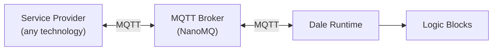
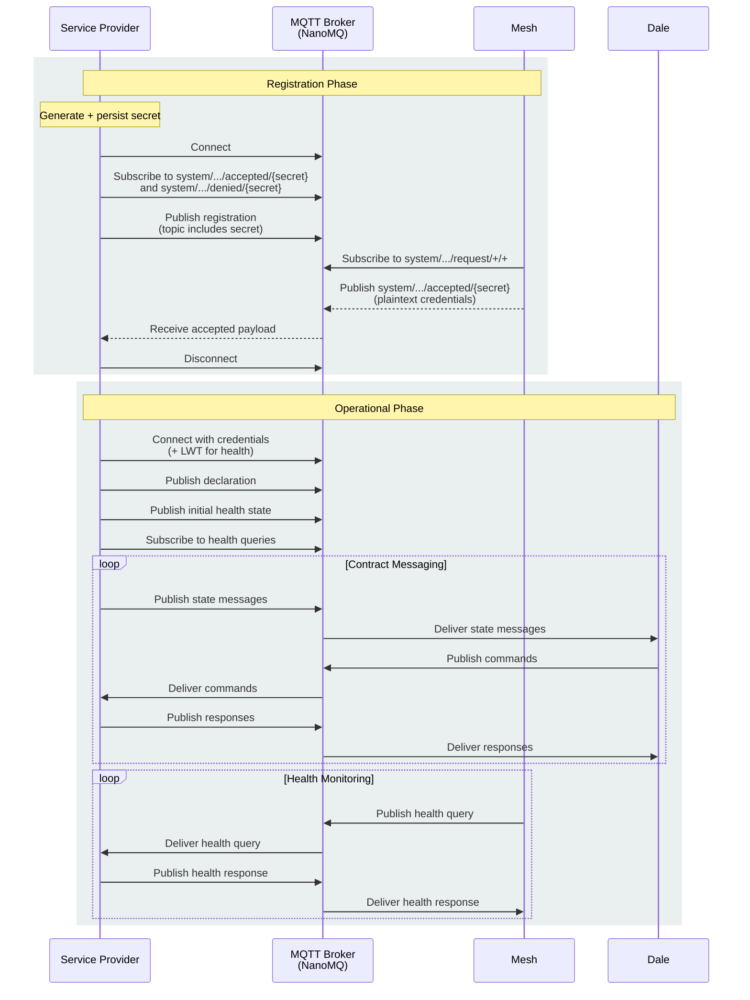

---
title: Service Provider Protocol
description: MQTT protocol specification for implementing custom service providers that communicate with the Dale runtime.
source: https://github.com/VION-IoT/documentation/blob/main/docs/sdk/service-provider-protocol.md
---

See [ServiceProviderProtocol](https://github.com/VION-IoT/documentation/blob/main/docs/sdk/service-provider-protocol.md) for a current version.

# Service Provider Protocol

A service provider is a standalone process that exposes hardware, bus protocols, or external systems to the Dale runtime over MQTT. This page defines the protocol that all service
providers must implement.

The protocol has two layers:

1. **Mandatory protocol** — registration, declaration, and health reporting. Same for every service provider.
2. **Service-specific messaging** — topics and payloads defined by each service provider type. The protocol makes no assumptions about their structure.

## Architecture



The service provider and the Dale runtime never communicate directly. All messages flow through the local MQTT broker. This means service providers can be written in any language
or technology that supports MQTT 5.0 — .NET, Python, Rust, CODESYS, TwinCAT, or bare-metal firmware.

## Prerequisites

- MQTT 5.0 client library
- Access to the registration broker (default: `nanomq:1883` on the local network)

## Registration

Registration lets the Dale runtime discover new service providers and provision credentials for the operational broker.

### Generate a Secret

On first startup, generate a random, non-guessable secret and persist it to survive restarts. The secret is used as a single MQTT topic segment — it ensures that only the service
provider that generated it can receive its registration response.

::: warning MQTT Topic Segment Constraints
The secret, serviceProviderIdentifier, serviceIdentifier, and contractIdentifier are all embedded directly in MQTT topics, so each **must be a valid single topic segment**:

- Must **not** contain `/` (topic level separator)
- Must **not** contain `+` or `#` (MQTT wildcard characters)
- Must **not** contain null characters
- Must **not** be empty
- Should be kept under 128 characters (MQTT topics have a 65535-byte UTF-8 limit, but shorter is better for broker performance)
- Should use only ASCII alphanumeric characters to avoid encoding issues across MQTT client implementations

**Recommended secret format:** A UUID v4 without hyphens — 32 lowercase hex characters (e.g., `a1b2c3d4e5f6a7b8c9d0e1f2a3b4c5d6`). This is what the Dale runtime uses internally.

For .NET service providers, use `RegistrationSecret.Generate()` from the `Dale.ServiceProvider.Sdk` (or `Guid.NewGuid().ToString("N")`).
:::

### Publish the Registration

Connect to the registration broker and publish a message:

| Field                  | Value                                                                                     |
|------------------------|-------------------------------------------------------------------------------------------|
| Topic                  | `system/serviceProvider/registration/request/{secret}`                                    |
| Payload                | JSON `ServiceProviderRegistrationRequestPayload` carrying the `serviceProviderIdentifier` |
| QoS                    | 1                                                                                         |
| Retain                 | yes                                                                                       |
| Content-Type           | `application/json`                                                                        |
| User property `schema` | `ServiceProviderRegistrationRequestPayload`                                               |

The `serviceProviderIdentifier` is a human-readable identifier for this provider instance (for example, `hal-sim`, `codesys-bridge-01`). It must be unique within the gateway (not
globally unique — different gateways may have providers with the same identifier). It travels in the **payload**, not the topic — mesh subscribes to
`system/serviceProvider/registration/request/+` (a single wildcard segment) and reads the identifier from the JSON. Publishing the request retained means a service provider that
comes online before mesh is up still gets picked up once mesh subscribes.

Example payload:

```json
{
  "serviceProviderIdentifier": "hal-sim"
}
```

### Subscribe to the Response

Subscribe to both:

- `system/serviceProvider/registration/accepted/{secret}`
- `system/serviceProvider/registration/denied/{secret}`

The topics contain only the secret, not the serviceProviderIdentifier — this prevents an attacker who knows the serviceProviderIdentifier from guessing the topic. The broker must
be configured to disallow wildcard subscriptions on `system/serviceProvider/registration/accepted/#` and `system/serviceProvider/registration/accepted/+` — this ensures that only
the service provider that knows the secret can receive credentials.

### Handle Acceptance

When the Dale runtime accepts the registration, it publishes plaintext JSON to the accepted topic:

```json
{
  "installationTopic": "v1/test/tenant123/gateway456",
  "host": "nanomq",
  "port": 1883,
  "clientId": "sp-hal-sim-a1b2c3",
  "username": "hal-sim",
  "password": "generated-password"
}
```

Store these credentials. Disconnect from the registration broker and proceed to the operational connection.

### Handle Denial

If denied, log the reason and retry after a delay.

## Operational Connection

Connect to the operational broker using the credentials from the accepted registration payload.

| Field     | Value                            |
|-----------|----------------------------------|
| Host      | `host` from accepted payload     |
| Port      | `port` from accepted payload     |
| Client ID | `clientId` from accepted payload |
| Username  | `username` from accepted payload |
| Password  | `password` from accepted payload |
| Protocol  | MQTT 5.0                         |

### Last Will Testament

Configure a Last Will Testament (LWT) so the broker publishes an offline health status if the service provider disconnects unexpectedly:

| Field        | Value                                                                    |
|--------------|--------------------------------------------------------------------------|
| Will Topic   | `{installationTopic}/{serviceProviderIdentifier}/component/health/state` |
| Will Payload | Health status with `connectionStatus: Offline`                           |
| Will QoS     | 1                                                                        |
| Will Retain  | yes                                                                      |

## Declaration

After connecting operationally, publish a declaration describing the services and contracts this provider offers.

| Field        | Value                                                                                |
|--------------|--------------------------------------------------------------------------------------|
| Topic        | `{installationTopic}/{serviceProviderIdentifier}/system/serviceProvider/declaration` |
| Payload      | JSON (see below)                                                                     |
| QoS          | 1                                                                                    |
| Retain       | yes                                                                                  |
| Content-Type | `application/json`                                                                   |

Declaration payload:

```json
{
  "services": [
    {
      "identifier": "di",
      "contracts": [
        { "identifier": "di0", "type": "DigitalInput" },
        { "identifier": "di1", "type": "DigitalInput" }
      ]
    },
    {
      "identifier": "do",
      "contracts": [
        { "identifier": "do0", "type": "DigitalOutput" },
        { "identifier": "do1", "type": "DigitalOutput" }
      ]
    }
  ]
}
```

The `type` field must match a `[ServiceProviderContractType]` known to the Dale runtime (for example, `DigitalInput`, `DigitalOutput`, `AnalogInput`, `AnalogOutput`, `ModbusRtu`,
or a custom type from a third-party Dale SDK package).

## Health Reporting

The Dale runtime periodically queries health status from all components.

### Respond to Health Queries

Subscribe to `{installationTopic}/{serviceProviderIdentifier}/component/health/get`. When a message arrives, publish a health response to the `ResponseTopic` from the request,
echoing the `CorrelationData`.

### Publish Health State

On connection and periodically, publish health state:

| Field   | Value                                                                    |
|---------|--------------------------------------------------------------------------|
| Topic   | `{installationTopic}/{serviceProviderIdentifier}/component/health/state` |
| Payload | Health status (FlatBuffer `ComponentHealthStatusPayload` or equivalent)  |
| QoS     | 0                                                                        |
| Retain  | yes                                                                      |

## MQTT Message Conventions

All messages on the operational broker follow these conventions:

| Convention                   | Detail                                                                        |
|------------------------------|-------------------------------------------------------------------------------|
| Protocol version             | MQTT 5.0 required                                                             |
| User property `schema`       | Payload type name (e.g., `DiStatePayload`, `SetDoPayload`)                    |
| User property `published_at` | ISO 8601 UTC timestamp                                                        |
| Content-Type                 | `application/x-flatbuffer`, `application/json`, or `application/octet-stream` |

## Service-Specific Messaging

Everything beyond registration, declaration, and health is defined by each service provider type. The protocol does not prescribe topic structure or payload format for
service-specific messaging.

### Topic Structure

All service-specific topics follow this pattern:

```
{installationTopic}/{serviceProviderIdentifier}/{service}/{contract}/{contract-specific-path}
```

| Segment                       | Description                                                                    |
|-------------------------------|--------------------------------------------------------------------------------|
| `{installationTopic}`         | Received during registration                                                   |
| `{serviceProviderIdentifier}` | This provider's identifier                                                     |
| `{service}`                   | Service identifier from the declaration                                        |
| `{contract}`                  | Contract identifier from the declaration                                       |
| `{contract-specific-path}`    | Must start with a unique routing segment, followed by provider-defined actions |

The first three segments after `{installationTopic}` form a **routing prefix** that identifies the provider, service, and contract. The contract-specific path must start with a *
*routing segment** — a fixed string unique to the contract type that the Dale runtime uses to dispatch messages to the correct handler (e.g., `hw/di` for digital inputs,
`hw/modbus` for Modbus, `codesys` for a custom CODESYS handler). Everything after the routing segment is provider-defined.

This structure enables simple broker ACL rules — a provider can be restricted to `{installationTopic}/{its-identifier}/#` with a single rule. Multiple providers can coexist on the
same gateway, each providing the same contract types under their own namespace.

### Built-in Contract Type Topics

The built-in contract types (DigitalIo, AnalogIo, ModbusRtu) use fixed action paths that correspond to the `Topics` constants defined in the `Vion.Contracts` package:

DigitalIo provider:

| Topic                                                                                          | Direction                                |
|------------------------------------------------------------------------------------------------|------------------------------------------|
| `{installationTopic}/{serviceProviderIdentifier}/{service}/{contract}/hw/di/state`             | Provider → Runtime (state update)        |
| `{installationTopic}/{serviceProviderIdentifier}/{service}/{contract}/hw/do/set`               | Runtime → Provider (set command)         |
| `{installationTopic}/{serviceProviderIdentifier}/{service}/{contract}/hw/do/set/dale/response` | Provider → Runtime (set acknowledgement) |
| `{installationTopic}/{serviceProviderIdentifier}/{service}/{contract}/hw/do/state`             | Provider → Runtime (state confirmation)  |

AnalogIo provider:

| Topic                                                                                          | Direction                                |
|------------------------------------------------------------------------------------------------|------------------------------------------|
| `{installationTopic}/{serviceProviderIdentifier}/{service}/{contract}/hw/ai/state`             | Provider → Runtime (state update)        |
| `{installationTopic}/{serviceProviderIdentifier}/{service}/{contract}/hw/ao/set`               | Runtime → Provider (set command)         |
| `{installationTopic}/{serviceProviderIdentifier}/{service}/{contract}/hw/ao/set/dale/response` | Provider → Runtime (set acknowledgement) |
| `{installationTopic}/{serviceProviderIdentifier}/{service}/{contract}/hw/ao/state`             | Provider → Runtime (state confirmation)  |

Modbus RTU provider:

| Topic                                                                                              | Direction                           |
|----------------------------------------------------------------------------------------------------|-------------------------------------|
| `{installationTopic}/{serviceProviderIdentifier}/{service}/{contract}/hw/modbus/get`               | Runtime → Provider (read request)   |
| `{installationTopic}/{serviceProviderIdentifier}/{service}/{contract}/hw/modbus/get/dale/response` | Provider → Runtime (read response)  |
| `{installationTopic}/{serviceProviderIdentifier}/{service}/{contract}/hw/modbus/set`               | Runtime → Provider (write request)  |
| `{installationTopic}/{serviceProviderIdentifier}/{service}/{contract}/hw/modbus/set/dale/response` | Provider → Runtime (write response) |

### Custom Contract Type Topics

Custom service providers define their own action paths. The contract-specific path must start with a **routing segment** — a fixed, non-ambiguous topic part that the Dale runtime
uses to dispatch messages to the correct handler actor. The runtime matches incoming topics using `topic.Contains(routingSegment)`, so the routing segment must be unique across all
registered handler types.

For example, the built-in types use `hw/di`, `hw/do`, `hw/ai`, `hw/ao`, and `hw/modbus` as routing segments. A custom CODESYS provider would define its own (e.g., `codesys`).

::: warning Routing Segment Uniqueness
The routing segment must not be a substring of any other registered routing segment, and vice versa. For example, a segment `hw` would conflict with the built-in `hw/di` because
one contains the other. The runtime rejects handler registrations with conflicting routing segments at startup.
:::

The structure after the routing segment is entirely up to the provider. It can be as granular as individual symbol addresses or as simple as a single action keyword with everything
else in the payload:

```
{installationTopic}/{serviceProviderIdentifier}/{service}/{contract}/{routing-segment}/{action...}
```

CODESYS provider (example — one handler, granular topic addressing):

```
{installationTopic}/codesys-01/plc/cpu1/codesys/state          # Variable state from PLC
{installationTopic}/codesys-01/plc/cpu1/codesys/set            # Write command to PLC
{installationTopic}/codesys-01/plc/cpu1/codesys/get            # Read request
{installationTopic}/codesys-01/plc/cpu1/codesys/get/response   # Read response
```

The Dale runtime subscribes to `{installationTopic}/+/+/+/codesys/#` and routes all matching messages to the `CodesysHandler`. The handler then interprets the remaining topic
segments and payload to determine what to do.

Alternatively, a provider that prefers a flat topic structure can put addressing in the payload:

```
{installationTopic}/codesys-01/plc/cpu1/codesys/rpc    # All requests/responses on one topic
```

### Interaction Patterns

Service providers typically use one or more of these patterns:

**State publishing** — the provider publishes retained state messages. Subscribers receive the latest value immediately on subscription and updates as they occur.

**Command handling** — the Dale runtime publishes commands (e.g., set a digital output). The provider processes the command and publishes a state confirmation.

**Request-response** — for operations that return data (e.g., Modbus register reads), use the MQTT 5.0 `ResponseTopic` and `CorrelationData` properties. The requester sets
`ResponseTopic` to indicate where the response should go. The responder publishes to that topic with the same `CorrelationData`.

### Serialization

Service providers choose their own serialization format. The `Content-Type` MQTT property distinguishes formats:

| Content-Type               | Description                                                                        |
|----------------------------|------------------------------------------------------------------------------------|
| `application/x-flatbuffer` | FlatBuffers binary format (used by built-in DigitalIo and AnalogIo)                |
| `application/json`         | JSON (recommended for custom providers — easiest to implement across technologies) |
| `application/octet-stream` | Custom binary format                                                               |

The dale runtime handler for each contract type must understand the serialization used by its corresponding service provider.

### Reserved Topic Prefixes

Service-specific topics must not use these prefixes:

| Prefix                                                             | Used by               |
|--------------------------------------------------------------------|-----------------------|
| `system/serviceProvider/`                                          | Registration protocol |
| `{installationTopic}/{serviceProviderIdentifier}/serviceProvider/` | Declaration           |
| `{installationTopic}/{serviceProviderIdentifier}/component/`       | Health reporting      |

## Lifecycle Summary

